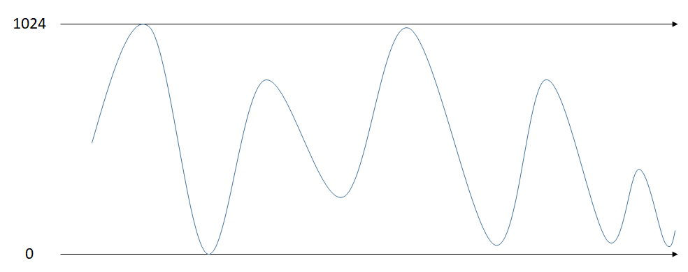

# 3월 25일

## 시작하기 전
1. DI / DO
    - 용량
    - 신호 레벨, 신호 종류
    - 보호, 절연
    - 회로 설계는 **프로그래밍 할 때 편하게**

2. SI(시리얼 통신)
    - UART / USART가 있지만 UART를 더 많이 씀
        - RS232
        - RS422/485
    - CAN
    - I2C
    - PWM
    - SPI
    - **UART 통신시 긴 거리 통신은 전압이 드롭되어 신호 수신이 잘 되지 않음**
        - 해결법 > 디퍼런셜(Differential)? > **이더넷, CAN ,RS422/485**
        - 방식 > OP amp > **연산 증폭기** > 같은 신호가 들어오면 사라짐
        - 노이즈가 제거됨
        - link : https://k96-ozon.tistory.com/60
    - 보드안에서 주로 사용하는 통신은 **SPI와 I2C**이다.

3. AI / AO (ADC / DAC)
    - ADC : AD Converter
        - ex) AVR 기준 : 10bit = *1024*
        - 
        - 1024기준, 512부터 **2로 나누기를 반복**하여 아날로그 값을 계속 찾아 나감
        - 오차가 적기 위해서는 bit수가 더 많아야 함

4. AVR MEGA 2560 VS STM32

    |           |    AVR MEGA 2560    |          STM32          |
    | :-------: | :-----------------: | :---------------------: |
    | 공급 전압 |         5V          |          3.3V           |
    |  RX 전류  |        20mA         |          10mA           |
    |   핀 수   |        100핀        |          100핀          |
    | 동작 클럭 |        16MHz        |         120Mhz          |
    | ~~통신?~~ |      USB(CAN)       |      USB x 2, CAN       |
    | ~~비트?~~ | Fuse bit(상태 설정) | **Boot bit(모드 설정)** |
    | 다운로더  |      ISP(6핀)       |       SWCLK(3핀)        |
    | 개발 환경 |    ATMEL Studio     |          CUBE           |

    5. 키르히호프의 법칙
       1. 전류 공식 : http://www.makeshare.org/bbs/board.php?bo_table=arduino&wr_id=104
       2. 저항이 커지면 ?

## 설치 할 것들
1. Circuit Maker
    - Altium과 비슷함
    - ~~학교에 있는 Altium은 버전이 10이라 사용하기 쫌...~~

